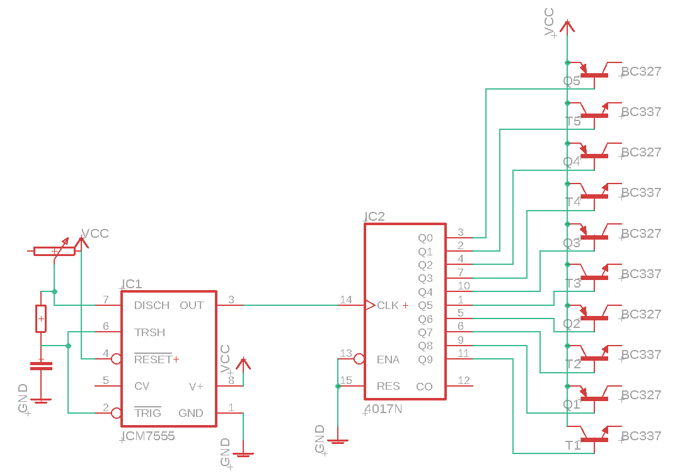

# Christmas Star

Sticking with tradition and going for the early days of electronics with this kit; using the traditional 555 Timer IC and a decade counter to make a strobing star pattern, something to put on-top of the christmas tree. Get some more globes and some logic gates if you're really up for it.				

## Bill of Materials
|Qty | Code | Description |
|--- | --- | --- |
|1 | [ZL3555](http://jaycar.com.au/p/ZL3555) | 555 Timer IC
|1 | [RE6066](http://jaycar.com.au/p/RE6066) | 10uf cap
|1 | [RR2774](http://jaycar.com.au/p/RR2774) | 1k resistor
|1 | [RP7510](http://jaycar.com.au/p/RP7510) | 10k pot
|1 | [HP9556](http://jaycar.com.au/p/HP9556) | experimenters board
|10 | [SL2673](http://jaycar.com.au/p/SL2673) | 6V globes
|1 | [ZC4017](http://jaycar.com.au/p/ZC4017) | 4017 decade counter
|5 | [ZT2115](http://jaycar.com.au/p/ZT2115) | NPN transistors
|5 | [ZT2110](http://jaycar.com.au/p/ZT2110) | PNP transistors
|1 | [MP3145](http://jaycar.com.au/p/MP3145) | 6V DC Power supply
|1 | [PS0519](http://jaycar.com.au/p/PS0519) | DC Socket

## Assembly

This unit complete old-school style electonics and can be a good starter for getting into how to read datasheets and circuit diagrams.

It is made of two stages, one is a 555 astable timer, which is a popular circuit for making small clock sources: this clock then goes into a 4017 stage counter, which turns on and off a collection of globes, which should twinkle as the star of your next christmas tree.

#### First Stage: Astable 555 Timer

We'll start by putting the 555 timer into astable mode; This is so common that there's even a [wikipedia](https://en.wikipedia.org/wiki/555_timer_IC#Astable) page about it. the circuit diagram and connection table is as follows:

###### Connections:

| 555 Timer Pin | Connection |
| --- | --- |
| 1 | Ground connection|
| 2 | Loops to pin 6 |
| 3 | Clock signal out (this is the one we want)|
| 4 | VCC |
| 5 | Not connected|
| 6 | One end of R1, and C1 to Ground|
| 7 | Other end of R1 and one end of the Potentiometer|
| 8 | VCC |

_Credits to jjbeard on wikipedia_

This will cause a clock signal to come out of pin3, which we can adjust the speed of by using the poteniometer to make it faster or slower.

Simply follow along with the diagram make sure that every connection matches, below is an image that I made in paint, which you should be able to scale to fit ontop of the mini experimenters board.

Mine looks a little different, because I did the perf-board diagram at a different time as to when I actually put it on the board. As long as the connections match up, it doesn't matter how you put it on the board. Here I snugged the resistor up against the pot vertically, and used two wires to act as jumpers to different parts. It's the same circuit, just laid out a tad differently.

#### Second Stage: 4017 Decade Counter

Next is the decade counter stage, which can cause a bit of confusion as the outputs are not sequencial, but I've laid it out below to make it easier to follow:

Following the datasheet, you can see the general idea of the decade counter: each clock cycle moves the active output through ten different pins:

The decade counter itself, doesn't have enough power to drive each of the incandescent globes, so I've included some transistors with the project to provide a power boost.

I won't go too far into transistors here, but to put simply, each of the output pins in the decade counter attaches to the base (middle pin) of the transistor. Then when one side is connected to the positive rail (VCC), the other side will light up the globe.

I've included both `PNP` and `NPN` transistors, so that we can have more sparkle. the `NPN` transistors will turn the globe ON when activated, and the `PNP` will turn the globe OFF. I've simply put all the odd numbered outputs as `NPN` (so globe 5, 7, 9, etc)

| 4017 Decade counter pin | Connection | 
| --- | --- |
| 1 | Globe 5 NPN| 
| 2 | Globe 1 NPN|
| 3 | Globe 0 PNP|
| 4 | Globe 2 PNP|
| 5 | Globe 6 PNP|
| 6 | Globe 7 NPN|
| 7 | Globe 3 NPN|
| 8 | Ground|
| 9 | Globe 8 PNP|
| 10 | Globe 4 PNP|
| 11 | Globe 9 NPN|
| 12 | Not connected|
| 13 | Ground|
| 14 | Clock signal from 555 stage|
| 15 | Ground | 
| 16 | VCC | 

The total circuit digram will look something like this:

Place the transistors on the board where you think they'd fit, so that one side of the transistor has a connection to the VCC rail of the board. If you have a power supply like the [MP3842](http//:jaycar.com.au/p/MP3842), you can test the circuit manually and see half the total lights light up (plus or minus a light, for the current output)

Finally, once you're happy with both stages, just connect the clock out of the 555 (pin 3) to the clock in of the 4017. Use the total circuit diagram above as reference

###### Don't forget
When you connect the two stages together, you should also be connecting the VCC and GND wires to both boards as well, so that they can both have power.

Add a bit of structure for the lights, you could use hard wire to bend it into a shape, or dress it around a barbie to act as an angel. I cut a star out of cardboard and hotglued my lights to it.

That's it! you're done. Test and play around with the circuit, and be sure to share an image of what you've created on our facebook page to show off your creations!

